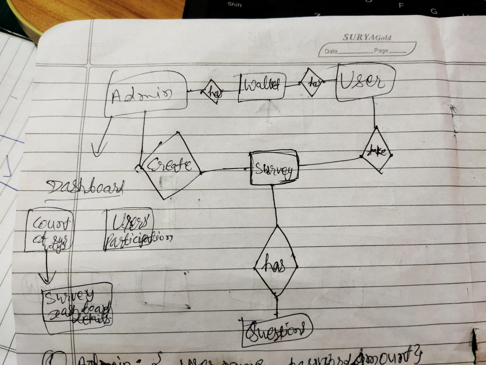
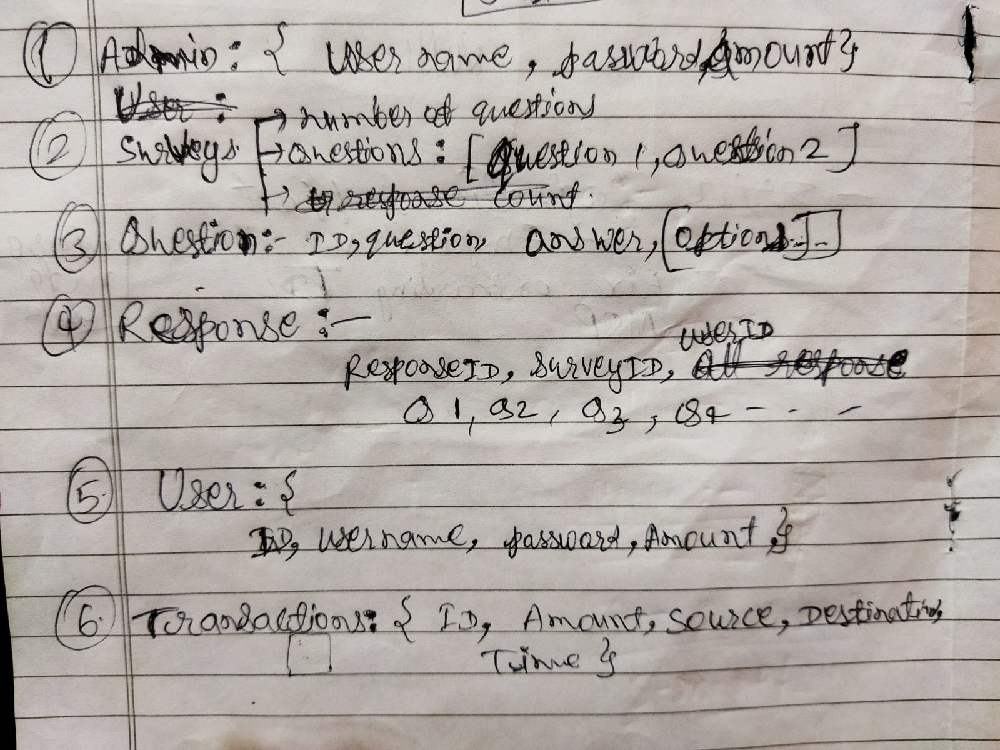
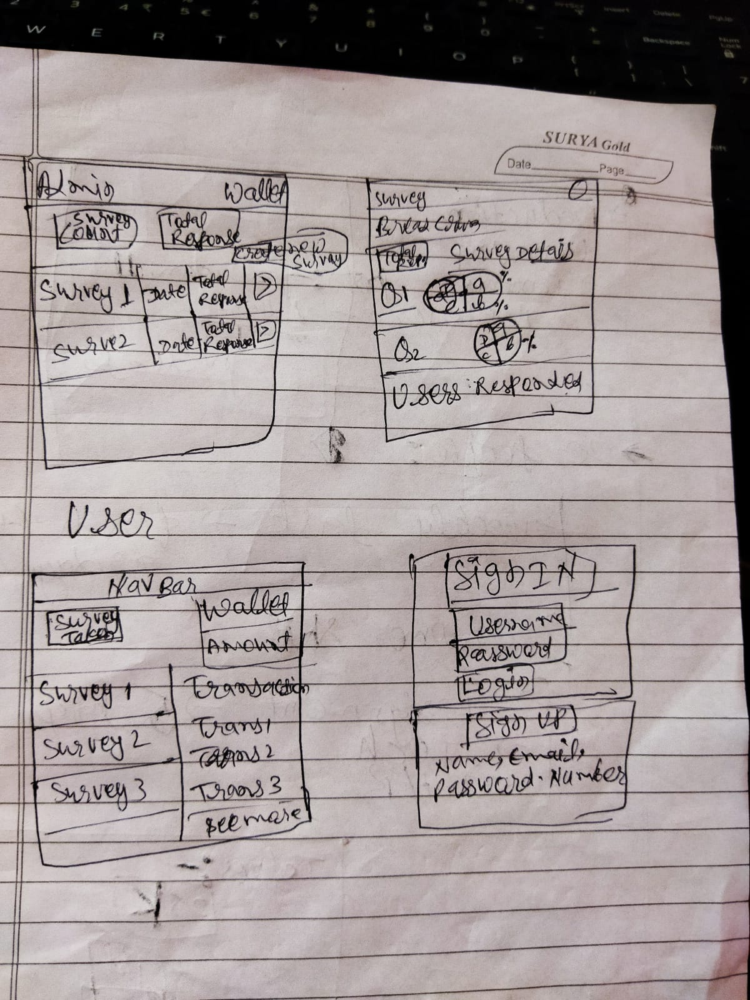

# Survey App

## Task
Consider a **survey system** where the admin can create surveys with questions and options and other registered users can respond.

- Whenever a user completes a survey he’ll get a predefined amount set by the admin in his wallet,
- There shouldn’t be duplicate submissions of responses to surveys
- there should be an analytics board to get details about each survey.
- Include rate-limiting for APIs to avoid an infinite number of calls in a minute from the same IP.

---

## Initial rough design

1. ER Diagram
    <!-- -  -->
    - 
2. Table schema design
    - 
    <!-- -     -->
3. Rough UI design
    - 
    <!-- -  -->
   